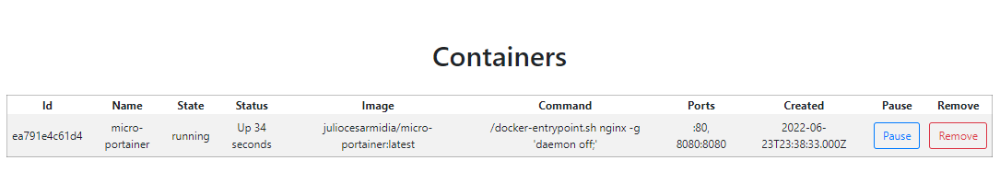

# Nginx Proxy for Docker API

Using Docker API being proxied by Nginx, to expose its information on some UI made with VueJS.

Based on Portainer:
[https://docs.portainer.io/v/ce-2.9/start/install/server/docker/linux](https://docs.portainer.io/v/ce-2.9/start/install/server/docker/linux)

> Running Portainer:

```bash
docker volume create portainer_data

docker container run -d \
  -p 8000:8000 \
  -p 9443:9443 \
  --name portainer \
  --restart=always \
  -v portainer_data:/data \
  -v /var/run/docker.sock:/var/run/docker.sock \
  portainer/portainer-ce:2.9.3
# access on https://localhost:9443

docker container logs -f --tail 50 portainer

# clean up
docker container rm -f portainer
docker volume rm portainer_data
```

## Up and Running (image from Docker Hub)
[https://hub.docker.com/repository/docker/juliocesarmidia/micro-portainer](https://hub.docker.com/repository/docker/juliocesarmidia/micro-portainer)

```bash
# default docker API version used: 1.41
docker container run -d \
  -p 8080:8080 \
  --name micro-portainer \
  --restart=always \
  -v /var/run/docker.sock:/var/run/docker.sock \
  juliocesarmidia/micro-portainer:latest
# access on http://localhost:8080

# logs
docker container logs -f --tail 50 micro-portainer

# clean up
docker container rm -f micro-portainer
```

## Up and Running (local build)

```bash
# retrieve current docker API version
export V_DOCKER_API="$(docker version | awk '/^\sAPI\sversion/{print $3}')"

docker-compose up -d --build micro-portainer
# access on http://localhost:8080

# logs
docker-compose logs -f --tail 50 micro-portainer
```

## UI access

[http://localhost:8080](http://localhost:8080)



## Registries

> Docker Hub

[https://hub.docker.com/repository/docker/juliocesarmidia/micro-portainer](https://hub.docker.com/repository/docker/juliocesarmidia/micro-portainer)

```bash
export DOCKERHUB_USERNAME='juliocesarmidia'
export DOCKERHUB_TOKEN=''
# login
echo "$DOCKERHUB_TOKEN" | docker login docker.io -u "$DOCKERHUB_USERNAME" --password-stdin
# push image
docker image push "docker.io/$DOCKERHUB_USERNAME/micro-portainer:latest"
```

> Github

[https://github.com/juliocesarscheidt/micro-portainer/pkgs/container/micro-portainer](https://github.com/juliocesarscheidt/micro-portainer/pkgs/container/micro-portainer)

```bash
export GITHUB_USERNAME='juliocesarscheidt'
export GITHUB_TOKEN=''
# login
echo "$GITHUB_TOKEN" | docker login ghcr.io -u "$GITHUB_USERNAME" --password-stdin
# tag and push image
docker image tag "docker.io/juliocesarmidia/micro-portainer:latest" "ghcr.io/$GITHUB_USERNAME/micro-portainer:latest"
docker image push "ghcr.io/$GITHUB_USERNAME/micro-portainer:latest"
```
