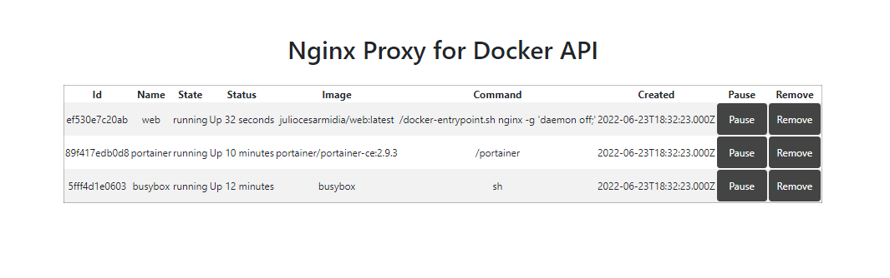

# Nginx Proxy for Docker API

Using Docker API being proxied by Nginx, to expose its information on some UI.

Based on Portainer:
[https://docs.portainer.io/v/ce-2.9/start/install/server/docker/linux](https://docs.portainer.io/v/ce-2.9/start/install/server/docker/linux)

> Running Portainer:

```bash
docker volume create portainer_data

docker container run -d \
  -p 8000:8000 \
  -p 9443:9443 \
  --name portainer \
  --restart=always \
  -v portainer_data:/data \
  -v /var/run/docker.sock:/var/run/docker.sock \
  portainer/portainer-ce:2.9.3
# access on https://localhost:9443

# clean up
docker container rm -f portainer
docker volume rm portainer_data
```

## Up and Running

```bash

docker-compose up -d --build web
docker-compose logs -f --tail 50 web

```

## UI access

[http://localhost:8080](http://localhost:8080)


